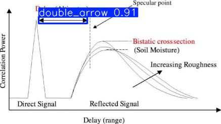
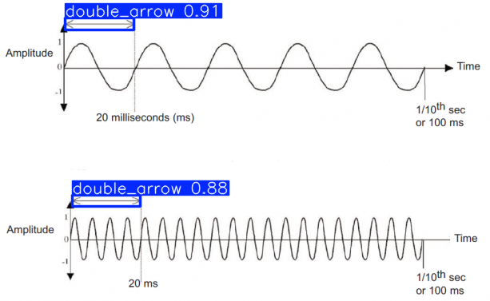
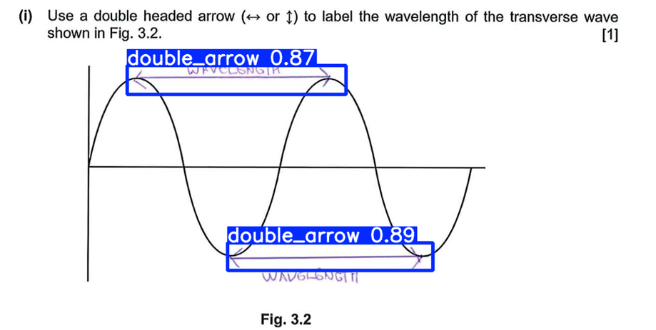

# 🌊 Waveform Double-Arrow Detection (YOLOv11)

本專案旨在自動生成帶有強烈干擾（文字、格線、多種顏色與粗細）的波形時序圖，並訓練 YOLOv11 模型來精準辨識圖片中的「雙箭頭 (Double-headed arrows)」。

## 🛠️ 1. 環境準備 (Environment Setup)

請確保您的電腦已安裝 Miniconda 與 NVIDIA 顯示卡驅動。

1. **建立並啟動虛擬環境：**
   ```bash
   conda create --name wave python=3.12
   conda activate wave
   ```
   安裝核心套件：

    ```
    pip install torch torchvision torchaudio --index-url [https://download.pytorch.org/whl/cu128](https://download.pytorch.org/whl/cu128)
    pip install ultralytics opencv-python numpy pyyaml
    ```

## 🗂️ 2. 自動生成資料集 (Generate Dataset)
可以在 config.yaml 中自由調整生成的圖片數量、大小與箭頭難度。

檢查並修改 config.yaml 中的 num_images (預設為 1000)。

執行生成腳本：
```
python generate_data.py
```
執行完畢後，系統會自動在專案內建立 dataset_v3 資料夾，並以 8:2 的比例切分好 train 與 val 資料集。

如果需要手動標註資料, 可以用label studio來輔助標記
```
pip install label-studio
label-studio
```
#### 初次在local打開要先sign up (個資不會上傳)
#### 進去後create project > labeling setup > computer vision > object detection with bounding boxes
#### 選擇好任務以後要設定label, 把預設的car移除改成你要的, 接著就可以上傳檔案開始標註
#### 標註完後, 在那個project的頁面右上角選export, 選YOLO 就會是yolov11支援的txt格式了.

##### 如果上傳檔案超出上限, 需要改成讓label studio sync local資料夾, 請向gemini請教


## 3.訓練模型
資料夾下有 data.yaml, 預設使用 YOLOv11 Nano 輕量模型，訓練 50 個 Epochs

```
yolo detect train data=data.yaml model=yolo11n.pt epochs=50 imgsz=800 batch=2
```

## 🔍 4. 執行預測 (Inference / Test)
預設使用我已經先訓練過的模型
```
python inference.py
```

## 已經訓練好的模型: 
`runs/detect/train5/weights/best.pt`基於 YOLOv11 Nano 架構訓練，並在包含高強度文字干擾、不同顏色與箭頭粗細的驗證集（Validation Set）上進行了嚴格評估。

* **測試資料集規模：** 200 張生成的複雜波形圖（共包含 395 個雙箭頭實例）。
* **硬體環境：** NVIDIA GeForce RTX 5070 Ti

| 評估指標 (Metrics) | 分數 (Score) | 說明 (What it means) |
| :--- | :--- | :--- |
| **Precision (精準度)** | 98.7% (0.987) | 當模型框出一個雙箭頭時，它有 98.7% 的機率是正確的（極少誤判文字或雜訊）。 |
| **Recall (召回率)** | 99.7% (0.997) | 圖片中真實存在的雙箭頭，模型能成功抓出 99.7%，幾乎沒有漏網之魚。 |
| **mAP@50** | 99.5% (0.995) | 綜合評估分數。只要預測框與真實框重合度達 50% 即算正確，在此寬鬆標準下模型表現接近滿分。 |
| **mAP@50-95** | 95.5% (0.955) | 嚴格的綜合指標。要求預測框極度精準地貼合目標，95.5% 代表模型框的位置非常精確。 |

## Enjoy!



